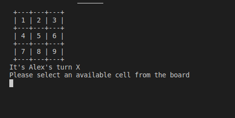

?style=plastic&logo=ruby>)

# Project - Tic Tac Toe

> The purpose of this project is to consolidate the acquired knowledge of the Ruby programming language. For this, we decided to develop a Video Game development project called Tic Tac Toe, in order to learn the correct operation of Object Oriented Programming.

This web page was the third Ruby Programming Language Project of the Microverse curriculum.
In this project, we learned the importance of Object Oriented Programming in programming languages and how Ruby can help us accomplish this task.

## Built With

?style=plastic&logo=ruby>)

## Getting Started

This project was created to study the importance of Object Oriented Programming and its application in Ruby.

### Prerequisites

Computer running [Mac OS](https://www.apple.com/macos/big-sur/), [Windows](https://www.microsoft.com/en-us/software-download/windows10), or [Linux Ubuntu](https://ubuntu.com/download). [Ruby V.3.0.0](https://www.ruby-lang.org/es/downloads/)...

### Install

Getting Started
To get a local copy up and running follow these simple example steps:

- You need to [clone](https://docs.github.com/en/github/creating-cloning-and-archiving-repositories/cloning-a-repository) or [download as zip file](https://www.itprotoday.com/mobile-management-and-security/how-do-i-download-files-github) the repository on your device.
- [Unzip](http://www.e7z.org/open-zip.htm) the repository or just clone it using git or github.
- Grab the main.rb file and open it on your favorite online code editor, for example [repl.it.](https://replit.com/)
- If you want to see the source code of the files located in my repository, you can do it through a [code editor of your choice](https://www.elegantthemes.com/blog/resources/best-code-editors), I recommend using [VSCode](https://code.visualstudio.com/), first, you must [install it by following these steps](https://code.visualstudio.com/docs), then you must [open the folder containing my repository in your local repository](https://thisdavej.com/right-click-on-windows-folder-and-open-with-visual-studio-code/#:~:text=You%20can%20now%20navigate%20to,with%20VS%20Code%E2%80%9D%20as%20well.) and [open each of the files](https://code.visualstudio.com/docs/editor/editingevolved) to see their content.
- If you have any questions or problems about how to run this project, you can leave me a comment in the [issues section](https://github.com/aristides1000/tic_tac_toe_project/issues) of this repository, I am more than willing to help you.

### Usage

Run main.rb with [Ruby V.3.0.0](https://www.ruby-lang.org/es/downloads/).

### Run tests

In order to run RSpec tests you can type in your terminal `rspec`

## Game Description

Tic-tac-toe is a paper-and-pencil game for two players, X and O, who take turns marking the spaces in a 3×3 grid. The player who succeeds in placing three of their marks in a diagonal, horizontal, or vertical row is the winner

## How to play

1. This game will take place in your computer's terminal. In order to open the terminal you only need to search for 'terminal' in your computer or hit "Ctrl + \`" or "Cmd + `" to open it.
2. In the terminal, type `cd` to go to the game's folder where you cloned the Tic Tac Toe repository. For example: Desktop/User/tic-tac-toe/. You can also use the comand `ls` to see the files listed in the folder.
3. Now, `cd` into `bin` folder by typying `cd bin` and executing the command `ruby main.rb` in the terminal to start the game. Or, you can just type `ruby bin/main.rb ` without change to `bin` directory.
4. Enjoy the game!

## Game rules

1. Type the name for Player1, and it will be assigned the symbol 'X';
2. Type the name for Player1, and it will be assigned the symbol 'O';
3. Now the first player can select any cell in the range of (1-9) to put his/her mark (X in this case)
4. Remember to insert a valid number (from 1 to 9) and don't repeat any number that is already taken by a symbol;
5. The first player to complete three marks in a row, column, or diagonal line will be the winner.

## Authors

👤 **Author**
Chibuike Uzoechina

- GitHub: @Chike1990
- Twitter: @ChibuikeUzoechi
- LinkedIn: @Chibuike-Uzoechina

👤 **Author**
Alexander Morales

- GitHub: [@alexandermorales-dev](https://github.com/alexandermorales-dev/)
- Twitter: [@Alexand81099721](https://twitter.com/Alexand81099721)
- LinkedIn: [AlexanderMorales](https://www.linkedin.com/in/alexander-morales-b8539898/)

## 🤝 Contributing

Contributions, issues, and feature requests are welcome!

Feel free to check the [issues page](https://github.com/aristides1000/tic_tac_toe_project/issues).

## Show your support

Give a ⭐️ if you like this project!

## License

This project is [CC0-1.0](LICENSE) licensed.

## Acknowledgments

- Ariel Camus CEO Microverse: For letting us start this journey.
- Google: For letting us find crucial information in order to create this project.
- Aristides Jose Molina Pérez
- GitHub: [@aristides1000](https://github.com/aristides1000) who I worked with for the game logic
